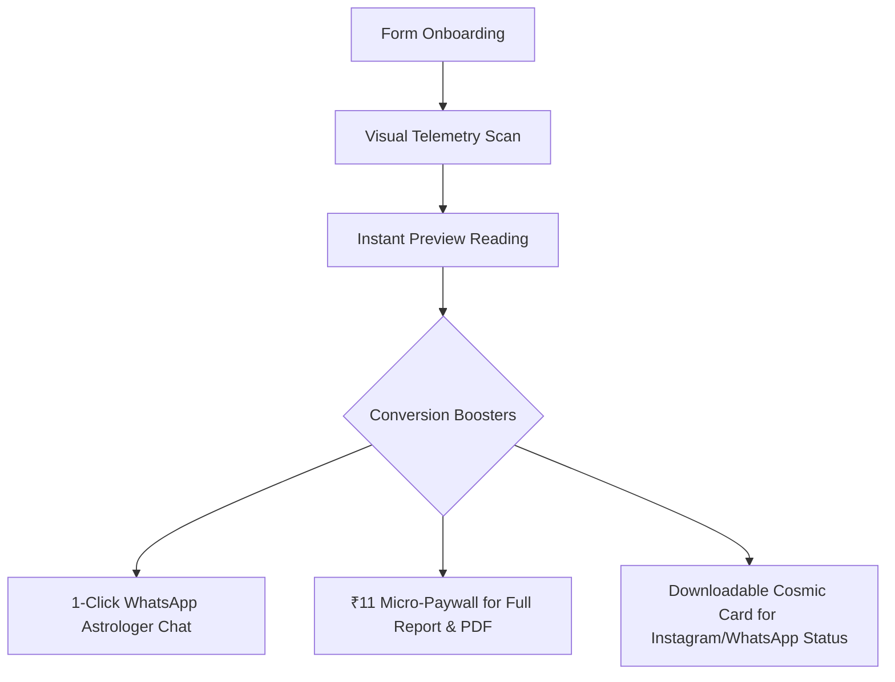

# Technical, Security & UX Audit Report: AstroSole

**Role:** Senior Product Manager & CTO  
**Version:** 1.0.0  
**Overall Security & UX Score:** **78 / 100**  
**Audit Scope:** Codebase, Input Validation, Security Boundaries, Payment Handlers, Mobile UX & Conversion Optimization  

---

## 1. Executive Summary & Security Scorecard

| Domain | Rating | Current Status | Recommended Action |
| :--- | :--- | :--- | :--- |
| **API Security** | ⚠️ Moderate | Gemini API key exposed in public JS bundle (`VITE_GEMINI_API_KEY`). | Proxy API calls via Vercel Edge Serverless Function (`/api/analyze-sole.js`). |
| **Payment Security** | ✅ Secure | HMAC SHA256 signature verification correctly implemented in `api/verify-payment.js`. | Keep key secret on Vercel environment variables. |
| **Input Validation** | ⚠️ Fair | Regex validation for Mobile and Email present; missing HTML XSS sanitization and Birth Chart fields. | Add XSS escaping + Birth Date/Time/City input fields. |
| **Mobile UX & Performance** | ✅ Excellent | Client-side canvas image compression (5MB ➔ ~80KB JPEG) + animated telemetry scanner. | Add real-time contour overlay on preview image. |
| **Zero-DB Reliability** | ✅ Robust | Multimodel fallback rotation + deterministic Podomancy engine fallback when offline. | Add Base64 URL payload hash sharing. |

---

## 2. Security & Vulnerability Analysis

### 2.1 API Key Exposure (`src/lib/gemini.ts`)
* **Vulnerability:** The client code accesses `import.meta.env.VITE_GEMINI_API_KEY`. In Vite, variables prefixed with `VITE_` are bundled directly into the compiled JavaScript files delivered to every web browser.
* **Threat Model:** Malicious users can extract the API key from browser dev tools and consume your Gemini quota for unauthorized requests.
* **Fix:** Move Gemini model execution inside a Vercel Serverless Function (`/api/analyze-sole.js`), removing `VITE_` prefix so `GEMINI_API_KEY` remains strictly server-side.

### 2.2 Payment Verification Security (`api/verify-payment.js`)
* **Audit Result:** **SECURE**.
* **Code Verification:**
  ```javascript
  const hmac = crypto.createHmac('sha256', keySecret);
  hmac.update(razorpay_order_id + "|" + razorpay_payment_id);
  const generated_signature = hmac.digest('hex');
  if (generated_signature === razorpay_signature) { ... }
  ```
  The HMAC SHA256 checksum correctly prevents client-side payment tampering.

### 2.3 Cross-Site Scripting (XSS) & Input Sanitization (`Scan.tsx` & `Result.tsx`)
* **Vulnerability:** User-submitted `name`, `address`, and `email` strings are rendered directly into HTML DOM and PDF generation functions without explicit HTML entity encoding.
* **Threat Model:** Entering payload strings like `` in the Name input field could cause script execution during PDF generation or custom share cards.
* **Fix:** Implement string sanitization function:
  ```typescript
  export const sanitizeInput = (str: string): string => {
    return str.replace(/[&<>"']/g, (match) => {
      const map: Record<string, string> = {
        '&': '&amp;',
        '<': '&lt;',
        '>': '&gt;',
        '"': '&quot;',
        "'": '&#x27;'
      };
      return map[match] || match;
    });
  };
  ```

---

## 3. Input Validation & Form UX Assessment

### 3.1 Current Validation Logic (`Scan.tsx`)
```typescript
// Mobile Validation
const mobileRegex = /^\+?[0-9]{10,15}$/;

// Email Validation
const emailRegex = /^[^\s@]+@[^\s@]+\.[^\s@]+$/;
```

### 3.2 Key Input & UX Gaps

1. **Missing Birth Chart Data (Date, Time & City of Birth)**
   * *Issue:* Podomancy in Vedic astrology is traditionally combined with birth time and ascendant calculations.
   * *Solution:* Add optional Birth Date (`<input type="date">`), Birth Time (`<input type="time">`), and City of Birth (`<input type="text">`) fields to elevate user trust.

2. **Aspect Ratio Image Validation (`Scan.tsx`)**
   * *Current Check:* Requires portrait ratio (`height / width >= 1.15`).
   * *UX Polish:* Provide an auto-crop / rotation helper UI if a user accidentally uploads a landscape foot photo.

3. **No Automatic Country Code Formatting**
   * *UX Polish:* Add default country code selection (`+91` for India, `+1` for USA, etc.) to streamline mobile input.

---

## 4. User Experience (UX) & Conversion Optimization (CRO)



### 4.1 Immediate UX High-Impact Enhancements

1. **Instagram / WhatsApp Status "Cosmic Sole Card" Generator**
   - Seekers love sharing aesthetic astrology summaries. Render a downloadable Canvas card summarizing their foot shape (e.g. *"Egyptian Fire Foot"*), core element, and cosmic lucky score.

2. **Google Sheets Automated Lead Collector (Zero-DB)**
   - Connect client form submission to a free Google Apps Script URL. Every lead is automatically appended to a private Google Sheet for your astrologers with zero database cost!

3. **Dynamic URL Hash Sharing**
   - Encode report data into Base64 URL parameters so seekers can copy and send their full reading URL to friends.

---
*End of Audit Report.*
