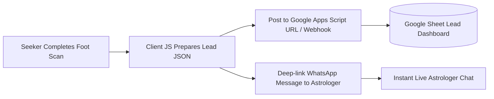

# Zero-Backend & Zero-Database Product Architecture: AstroSole

**Tagline:** *Astrology of Your Sole*  
**Role:** Senior Product Manager & CTO  
**Version:** 2.0.0 (Jamstack & Client-Centric Native)  
**Architecture Constraint:** 100% Zero-Database & Zero-Dedicated-Backend Overhead  

---

## 1. Executive Summary & Strategy Pivot

By explicitly removing the requirement for a traditional backend server and database, **AstroSole** operates as a hyper-fast, low-cost, ultra-scalable **Jamstack Web Application**. 

This document outlines the **Zero-DB Product Strategy**: how to achieve enterprise-grade lead capture, viral sharing, instant payments, report persistence, and astrologer handoff using client-side capabilities (IndexedDB, Webhooks, Canvas, URL Encoded Payloads) and Vercel Serverless proxying.

---

## 2. Zero-DB Architecture Matrix

| Capability | Traditional DB Approach | AstroSole Zero-DB Strategy | Product Benefit |
| :--- | :--- | :--- | :--- |
| **Report Persistence** | Save to PostgreSQL / MongoDB | **URL Base64 / Hash State & Browser IndexedDB** | Seekers can save, bookmark, and share their exact report URL. Works offline & instantly! |
| **Lead Capture** | Store in SQL database | **Google Apps Script / Webhook (Zapier/Formspree) + WhatsApp Deep Link** | Zero database cost. Leads stream automatically into Google Sheets and WhatsApp. |
| **PDF Generation** | Server-side Puppeteer | **Client-side `html2pdf.js` / Canvas PDF engine** | Zero server CPU cost. Instant 1-click PDF download directly on mobile browser. |
| **Monetization** | DB order reconciliation | **Client-side Razorpay SDK + Webhook trigger** | ₹11 micro-transactions and ₹499 consultation bookings processed instantly in client JS. |
| **API Security** | DB token management | **Stateless Vercel Serverless Proxy (`/api/analyze.js`)** | API keys remain 100% secret on serverless environment without needing any database. |

---

## 3. Deep Feature Specifications for Zero-DB App

### 3.1 URL-Encoded Sharable Reports & IndexedDB Storage
* **Base64 Payload URLs:** Encode seeker reading results into a compressed URL hash:
  `https://astrosole.in/result#data=eyJuYW1lIjoiQW5hbnlhIiwic2hhcGUiOiJFY3lwdGlhbiIsImFyY2giOiJISUdIIiwiem9kaWFjIjoiTGVvIn0=`
  When shared on WhatsApp, any friend clicking the link views the full interactive report immediately.
* **IndexedDB Local History:** Store past scans in browser `IndexedDB` so returning seekers can view their past foot readings without logging in.

### 3.2 Google Sheets & WhatsApp Business Lead Pipeline

* **Google Apps Script Webhook:** A free 10-line Google Apps Script receives lead data via HTTP POST and appends it directly to a private Google Sheet.
* **Smart WhatsApp Payload:** Generates formatted chat message:
  ```text
  🔮 NEW ASTROSOLE CONSULTATION REQUEST 🔮
  ---------------------------------
  Name: Ananya Sharma
  Foot Shape: Egyptian (Water Element)
  Zodiac: Leo | Arch: High Arch
  Payment Status: VERIFIED (₹11 Paid)
  Report URL: https://astrosole.in/result#data=...
  ```

### 3.3 Viral "Cosmic Sole Card" Social Media Engine
* **Spotify Wrapped for Solistry:** Use HTML5 Canvas to generate a high-contrast cosmic graphic card featuring the seeker's foot shape (e.g. *"Egyptian Fire Foot"*), core personality trait, and luck score.
* **1-Click Share:** Downloads directly to device or uses Web Share API (`navigator.share`) for 1-click sharing to Instagram Stories, WhatsApp Status, and Snapchat.

### 3.4 Tiered Monetization Funnel (Zero-DB)

```mermaid
funnel
    title Conversion Funnel & Product Tiers
    "Free Scan Preview" : 1000 Seekers (Foot Shape & Personality Trait)
    "₹11 Basic Report" : 250 Seekers (Full Career, Health, Love & PDF Download)
    "₹99 Remedy Protocol" : 60 Seekers (Lucky Gemstone, Yantra & Planetary Chart)
    "₹499 VIP Consultation" : 15 Seekers (1-on-1 Astrologer Session via WhatsApp)
```

1. **Tier 1 (Free):** Instant AI foot shape detection & basic personality summary.
2. **Tier 2 (₹11 - Micro-Conversion):** Unlocks full Destiny, Health, Career & Relationship predictions + Downloadable PDF.
3. **Tier 3 (₹99 - Remedy Pass):** Custom gemstone, planetary Yantra, and lucky color/day recommendations based on Solistry + Vedic birth chart.
4. **Tier 4 (₹499 - VIP Astrologer Call):** Priority 1-on-1 consultation booking with Grand Astrologer via WhatsApp.

---

## 4. Architectural Enhancements to Build Next

### 1. Client-Side Image Telemetry Overlay (`Scan.tsx`)
Render dynamic visual contour lines, arch depth curves, and glowing energy points directly on top of the user's uploaded foot image using an HTML5 overlay canvas.

### 2. Vercel Serverless API Proxy (`/api/analyze.js`)
Create a lightweight, stateless Vercel Serverless Function to route Gemini API calls. This keeps your API key 100% secret on Vercel while requiring **zero database**.

### 3. Google Apps Script Webhook Integration
Connect client-side lead capture directly to a free Google Sheet for seamless lead management by your astrologer team.

---
*End of Zero-DB PRD Document.*
