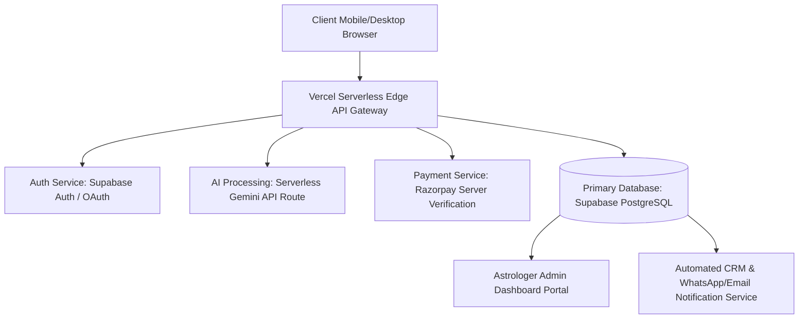

# Enterprise Architecture Product Requirement Document (PRD): AstroSole

**Tagline:** *Astrology of Your Sole*  
**Role:** Senior Product Manager & CTO  
**Version:** 1.0.0 (Enterprise Full-Stack Architecture)  
**Architecture Type:** Dedicated Backend & Database Ecosystem  

---

## 1. Executive Summary & Product Vision

**AstroSole** is an AI-powered Podomancy (Solistry) web platform bridging ancient foot astrology with modern computer vision telemetry. By analyzing bare foot sole contours, arch shapes, toe alignments, and planetary birth charts, AstroSole delivers personalized readings for career, health, relationships, and karmic path, while connecting seekers directly with expert astrologers.

---

## 2. Enterprise System Architecture

---

## 3. Core Capabilities & Functional Requirements

### 3.1 User Authentication & Profile Management
* **Authentication Engine:** Supabase Auth / NextAuth supporting Phone OTP (Twilio/Msg91) and Google OAuth.
* **Seeker Vault:** Persistent personal dashboard storing past sole scans, historical birth charts, and purchased premium PDF reports across all user devices.

### 3.2 Server-Side AI Telemetry Verification
* **Protected API Gateway:** Gemini multimodal API calls routed strictly via serverless backend endpoints (`/api/analyze-sole.js`), eliminating client-side API key exposure.
* **Bilateral Mirror Symmetry Engine:** Server-side structural coordinate normalization mapping active (right) vs. passive (left) foot dimensions.

### 3.3 Astrologer Partner & Admin Portal
* **Lead Desk:** Secured dashboard for verified astrologers to view incoming seeker leads, high-res sole scan images, natal charts, and payment verification receipts.
* **Consultation Queue:** Workflow tracking (`New Lead` ➔ `Consultation Scheduled` ➔ `Remedy Prescribed` ➔ `Completed`).

### 3.4 Tiered Monetization & Subscription SaaS Model
* **Tier 1 (Free):** Instant AI foot shape detection & basic personality summary.
* **Tier 2 (₹11 Micro-Report):** Full Destiny, Health, Career & Relationship predictions + Downloadable PDF.
* **Tier 3 (₹99 Remedy Pass):** Custom gemstone, planetary Yantra, and lucky color recommendations.
* **Tier 4 (₹499 VIP Call):** 1-on-1 Astrologer Session via WhatsApp.
* **Tier 5 (₹199/month SaaS Pass):** Weekly planetary transit updates, lunar sole alignment dates, and discounted consultation passes.

---

## 4. Technical Audit & Vulnerability Matrix

| Component | Technical Vulnerability / Gap | Enterprise Solution |
| :--- | :--- | :--- |
| **API Security** | Gemini API key exposed in public JS bundle (`VITE_GEMINI_API_KEY`) | Migrate API calls to Vercel Serverless `/api/analyze-sole.js` |
| **Data Retention** | Data stored in client React state / `localStorage` | Store users, readings, and payments in **Supabase PostgreSQL** |
| **User Identity** | No login mechanism; report lost on page refresh | Integrate **Phone OTP / Google OAuth** |
| **Payment Logic** | Price hardcoded to ₹11 in `api/create-order.js` | Dynamic server-side product catalog & Razorpay webhook reconciliation |
| **Lead Handoff** | Raw `wa.me` links without tracking | **WhatsApp Business API (Interakt/Wati)** automated CRM triggers |

---
*End of Enterprise PRD Document.*
